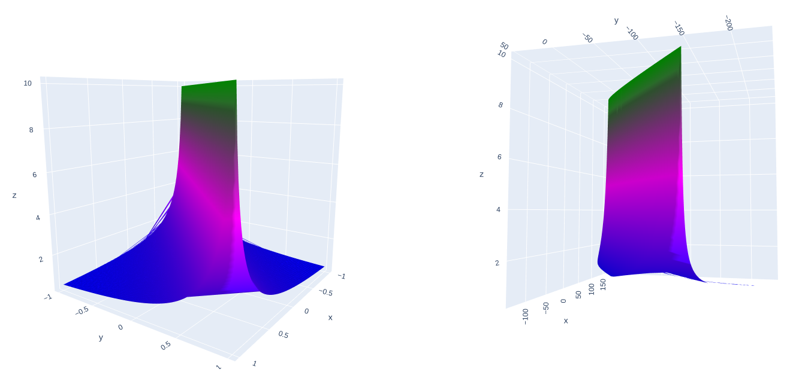

# Deep Kernel Ridge Regression [](https://colab.research.google.com/drive/1kBMI1kXE2MNYYsn3zA9kInkhRkWi_MJB?usp=sharing)

Library and Plots based on the paper  by B. Bohn et al.

## Installation

NOTE: it is recommended to use a seperate virtual environment

Make sure that you are inside the root directory of this repo

Step 1: install imagemagick

```Shell
> apt install imagemagick
```

Step 2: install python dependencies

```Shell
> pip install -r requirements.txt
```

## Getting Started

Lets perform Deep Kernel ridge regression on synthetic data similar to the paper.

```python

from compositeKRR import DeepKernelRegression as dkr
from utils import createSyntheticData, train_loop
import gpytorch as gpy
import torch.nn as nn
import torch

# specify the data.
num_data_points = 10
_,r,data_x,data_y, data_y_h2 = createSyntheticData(num_data_points)


# create deep kernel model with 2 layers
degree = 2
K_1 = gpy.kernels.PolynomialKernel(degree) # inner kernel
K_2 = gpy.kernels.MaternKernel() # outer kernel
kernels = [K_1, K_2]
ranges = [2, 1] # output dim of each kernel layer.
model = dkr(ranges, data_x, kernels, device="cpu")

# training our model
num_epochs = 5000
learning_rate=0.0001
loss = nn.MSELoss()
optimizer = torch.optim.Adam(model.parameters(), lr=learning_rate, weight_decay=1e-5)
train_loop(data_x, data_y, model, loss, optimizer, num_epochs)

```


after training it for 10K epochs, the inner layer representation looks like this ( which is awefully close to our original function)  :-



we can also look at the computation graph of our model using torchviz:
.

### What now?

umm... Play with it! add new kernels, increase the depth, using gpus to speed things up... sky is the limit! ;D

If you find some bugs or create a cool new feature then please feel free to file an issue or send a PR!.

## Change Logs

* Now we can use more then 2 layers. 🚀
* Added the functionality of loading and saving model in e2eKRR 🤓
* Restructured Codebase and removed dead code ⚰️

## License


